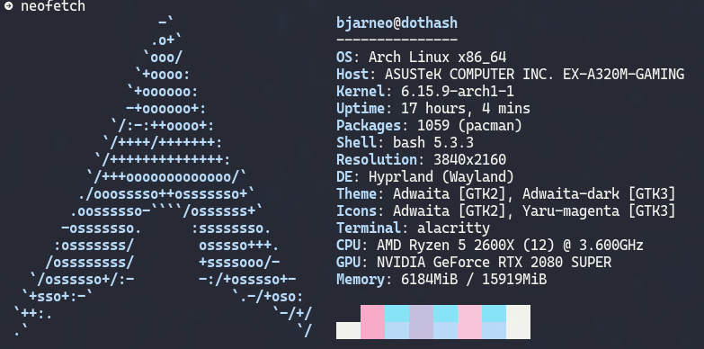

# Omarchy Aura Theme

This is the Aura theme for [Omarchy.org](https://omarchy.org), providing a visually appealing configuration set for your Linux desktop environment.

<p align="center">
  
</p>

<p align="center">
  
</p>

## Installation

To install this theme, simply use the `omarchy-theme-install` command:

```bash
omarchy-theme-install https://github.com/bjarneo/omarchy-aura-theme
```

## X.com
[iamdothash](https://x.com/iamdothash)
